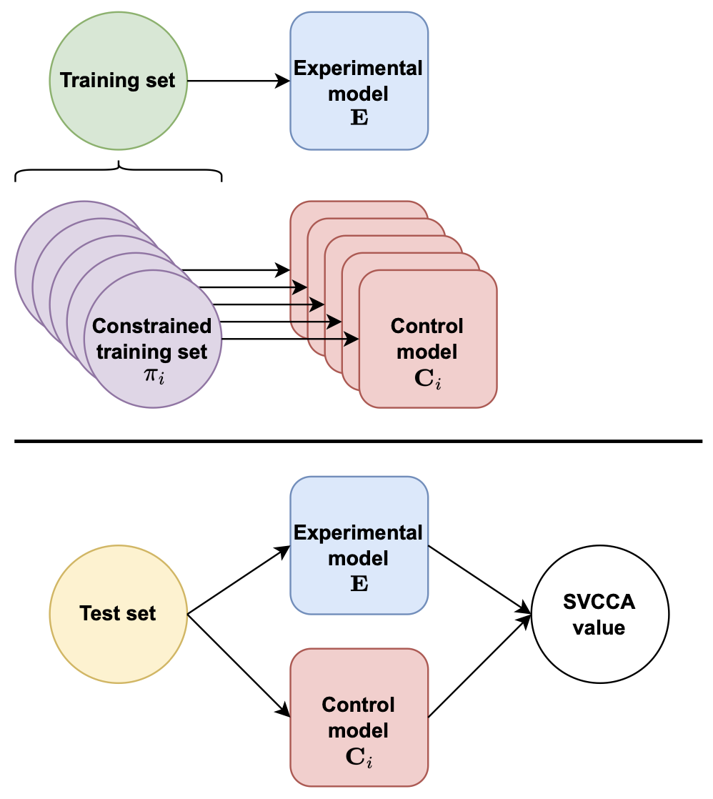

<p align="center" width="100%">

</p>

# Understanding Domain Learning in Language Models Through Subpopulation Analysis
This repository contains code for the paper "Understanding Domain Learning in Language Models Through Subpopulation Analysis" [[pdf](https://aclanthology.org/2022.blackboxnlp-1.16/)]. 

## Required Packages
To install required packages, run the following command:
```
pip -r requirements.txt
```

## Data
You can choose any training data to train your model. For our work, we use the Amazon Reviews dataset. You can download the data from [here](https://cseweb.ucsd.edu/~jmcauley/datasets.html#amazon_reviews). 

Once you download all the data (should be in *.json.gz file format), you should place each file to the relevant folder named after the category name, i.e. `Books/Books_5.json.gz`. Then, you can run the following code to create data splits:

```
python code/preprocess/main.py 
  --category Books \
  --data_dir /path/to/directory/contains/all/review/categories \
  --reviews_per_class 50000\
  --train_size 100000 \
  --val_size 20000 \
  --test_size 20000
```
Note that if you set `reviews_per_class` to 1000, you will get 2000 reviews since the code aims to create a balanced dataset. You can read more in [this repo](https://github.com/yftah89/domain-distance). Setting `train_size`, `val_size`, and `test_size` will control the final data split size. Note that you should set `reviews_per_class` * 2 >= (`train_size` + `val_size` + `test_size`)

Once you run the above code for all categories, then you can run the following script to help you create different data splits used in the control/experimental models mentioned in the paper. 

```
$ ./code/preprocess/data.sh
```
For example, in the paper, a 100% data split has 50K training data for the experimental model E (mixing 5 domains), which means each domain's control model (C<sub>i</sub>) will have 10K data in the training set. After running the above script, you will find 
`top5/Train_100_data_top5.txt`, and `Books/Train_general_100_data_Books.txt`, etc. 

Note that we also create control data splits for C<sub>i</sub> that has the same size as E (i.e. for 100% data size, the control model also has 50K data), these files are `Books/Train_100_data_Books.txt`, etc. You should decide which one to use in your experiment. We do this as the notion of "control" can be:
- "controlling the information both models see": both E and C<sub>Books</sub> has seen the same 10K Book's data;
- "controlling the size both models see": both E and C<sub>Books</sub> has seen the same amount of data (50K). 

In the paper, we use the first interpretation. 
## Train
To train models, we use `accelerate` package which handles multi-GPU training. The following example is used to train a `bert-base-uncased` model using 4 NVIDIA A100 GPUs:
```
CATEGORY=top5
DATASIZE=100
EXP_NAME=${MODELSIZE}_model_${DATASIZE}_data
accelerate launch code/run_MLM.py \
  --per_device_train_batch_size 32 \
  --num_train_epochs 500 \
  --config_name bert-base-uncased \
  --tokenizer_name bert-base-uncased \
  --train_file /path/to/your/AmazonReviewData/${CATEGORY}/Train_${DATASIZE}_data_${CATEGORY}.txt \
  --validation_file /path/to/your/AmazonReviewData/${CATEGORY}/Val_${DATASIZE}_data_${CATEGORY}.txt \
  --line_by_line True \
  --output_dir ./checkpoints/seed1/${EXP_NAME}/${CATEGORY}-mlm/ \
  --log_dir ./log/ \
  --hidden_size 768 \
  --num_hidden_layers 12 \
  --num_attention_heads 12 \
  --intermediate_size 3072 \
  --seed set_your_seed_number_here
  ```
To train C<sub>i</sub> models, you need to set `CATEGORY` to be `Books`/ `Clothing_Shoes_and_Jewelry`/ `Electronics`/ `Home_and_Kitchen`/ `Movies_and_TV`. For E model, you need to set it to `top5`. You can change `DATASIZE` and `hidden_size` to run experiment in different settings. In the paper, the following values are used:

- `DATASIZE`: 10, 50, 100, 200
- `hidden_size`: 72, 192, 384, 576, 768

## Inference
The following example does inference using `bert-base-uncased` model and store the activations (hidden_states) file. You can specify `layer_to_store` which ranges from 0 to `num_hidden_layers`, you can also specify `hidden_size` and `intermediate_size` for your specific model config.
```
python code/run_MLM.py \
    --eval \
    --per_device_eval_batch_size 1 \
    --config_name bert-base-uncased \
    --tokenizer_name /path/to/your/checkpoint/ \
    --test_file /path/to/your/data.txt \
    --line_by_line True \
    --model_name_or_path /path/to/your/model/checkpoint/ \
    --activation_output_dir /path/to/store/your/activation/files/ \
    --activation_output_file your_filename.npy \
    --get_activation \
    --layer_to_store 0 \
    --hidden_size 768 \
    --num_hidden_layers 12 \
    --intermediate_size 3072 \
    --seed set_a_seed_number_here 
```

You could also use the provided script to help you run inference/evaluation in one script:

```
$  ./scripts/inference.sh
```
In the script, you will need to set the following variables:
- `MODELSIZE`: can take values of 10, 25, 50, 75, 200
- `HIDDEN_DIM`: can take values of 72 192 384 576 768 (corresponding with `MODELSIZE`)
- `epoch`: for each experiment, the best epoch number may be different, so you would need to determine the epoch number and place it to a folder for each category with specific settings. Then, you can replace this value with the folder name. 
- `DEVICE`: device number for your GPU
- `HOME_DIR`: your home directory

## SVCCA Analysis
Our analysis is based on Google's SVCCA [repo](https://github.com/google/svcca). You can specify `SVD_DIM` to control the dimension to keep after SVD. In general, you would like to keep dimensions that can explain 99% variance. 
```
python code/analysis.py \
    --data_dir1 /data/path/to/your/hidden_states.npy \
    --data_dir2 /data/path/to/your/hidden_states.npy \
    --do_svcca \
    --svd_dim1 $SVD_DIM \
    --svd_dim2 $SVD_DIM
```

Again, you could use the provided script to run all SVCCA in one go:
```
$ ./scripts/run_svcca.sh
```
You will need to manually set `best_epoch` for `epoch1` and `epoch2`, similar to what you did for the inference script. 

## Citation
```
@inproceedings{zhao-etal-2022-understanding,
    title = "Understanding Domain Learning in Language Models Through Subpopulation Analysis",
    author = "Zhao, Zheng  and
      Ziser, Yftah  and
      Cohen, Shay",
    booktitle = "Proceedings of the Fifth BlackboxNLP Workshop on Analyzing and Interpreting Neural Networks for NLP",
    month = dec,
    year = "2022",
    address = "Abu Dhabi, United Arab Emirates (Hybrid)",
    publisher = "Association for Computational Linguistics",
    url = "https://aclanthology.org/2022.blackboxnlp-1.16",
    pages = "192--209",
}
```
